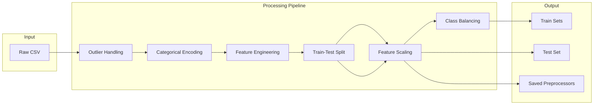

# Feature Engineering Plan for Personal Loan Classification

## Overview

Transform raw data from data exploration phase into model-ready features using techniques from `data_exploration_summary.md`. The notebook will process 45,000 records with 16 features to predict loan approval status.

## Data Flow



## Implementation Steps

### Step 1: Setup and Data Loading

- Create notebook structure with markdown headers matching Phase 1 style
- Load dataset from `data/Dataset - 2526.csv`
- Separate features (X) from target (y = `loan_status`)
- Print initial shape and dtypes for verification

### Step 2: Outlier Handling

Address outliers identified in EDA:

| Feature | Issue | Action |
|---------|-------|--------|
| `person_age` | Max 144 (erroneous) | Cap at 100 |
| `person_income` | Max 7.2M, highly skewed | Cap at 99th percentile + log transform |
| `person_emp_exp` | 3.8% outliers | Cap at 99th percentile |
| `loan_amnt` | 5.2% outliers | Cap at 99th percentile |

### Step 3: Categorical Encoding

Using `LabelEncoder` pattern from course:

- **Binary:** `person_gender`, `previous_loan_defaults_on_file`
- **Ordinal:** `person_education` (High School < Associate < Bachelor < Master < Doctorate)
- **Nominal:** `person_home_ownership`, `loan_intent` (use Label or One-Hot encoding)

### Step 4: Feature Engineering

Create targeted derived features:

- `log_income` = log1p(`person_income`) — handle extreme skewness
- `log_loan_amnt` = log1p(`loan_amnt`) — handle skewness
- `income_per_household` = `person_income` / `ppl_household` — per-capita affordability
- `credit_hist_age_ratio` = `cb_person_cred_hist_length` / `person_age` — credit maturity relative to age

### Step 5: Train-Test Split

```python
X_train, X_test, y_train, y_test = train_test_split(
    X, y, test_size=0.2, stratify=y, random_state=38
)
```

- Stratify to preserve 77.8%/22.2% class ratio in both sets

### Step 6: Feature Scaling

- Apply `StandardScaler` (fit on train, transform both)
- Store unscaled version for Random Forest
- Save scaler to `models/preprocess.pkl`

### Step 7: Class Imbalance Handling

Apply to training data only:

- Primary: `SMOTE(random_state=38)`
- Compare with original to show distribution change
- Expected result: ~50/50 balanced training set

### Step 8: Save Artifacts

Save to `models/` directory:

- `preprocess.pkl` — scaler and encoders
- Optionally export processed train/test CSVs

### Step 9: Documentation

Final markdown cell summarizing:

- Feature list with transformations applied
- Class distribution before/after SMOTE
- Ready-to-use variable names for Phase 3
