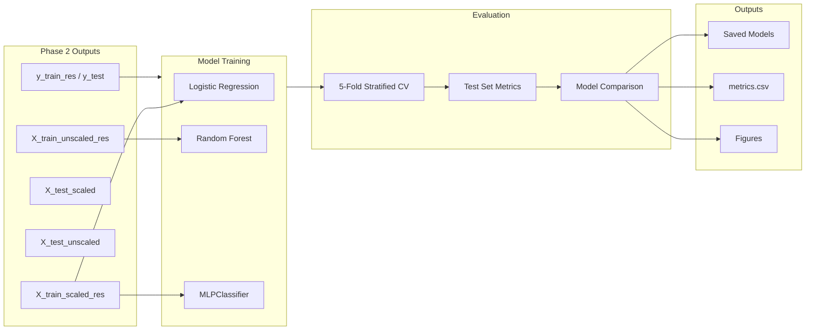

# Phase 3: Model Training Implementation Plan

## Overview

Train and evaluate three baseline models on preprocessed loan approval data from Phase 2 (Feature engineering), establishing benchmarks before hyperparameter optimization in Phase 4 (Optimisations).

## Data Flow



## Implementation Steps

### 1. Setup and Data Loading

- Re-run feature engineering pipeline from `02_feature_engineering.ipynb` to get preprocessed variables
- Load `models/preprocess.pkl` for feature names
- Verify shapes: `X_train_scaled_res` (56000, 19), `X_test_scaled` (9000, 19)

### 2. Define Evaluation Framework

Create reusable functions in a single cell:

```python
def evaluate_model(model, X_test, y_test, model_name):
    """Returns dict of all metrics."""
    
def plot_confusion_matrix(y_true, y_pred, model_name):
    """Seaborn heatmap with annotations."""
    
def cross_validate_model(model, X, y, cv=5):
    """Stratified K-Fold, returns mean±std for each metric."""
```

### 3. Train Logistic Regression

- Model: `LogisticRegression(random_state=38, max_iter=1000)`
- Data: `X_train_scaled_res`, `y_train_res`
- Run 5-fold CV, then final test evaluation
- Save to `models/logistic_regression.pkl`

### 4. Train Random Forest

- Model: `RandomForestClassifier(random_state=38)`
- Data: `X_train_unscaled_res`, `y_train_res` (unscaled!)
- Run 5-fold CV, then final test evaluation
- Plot feature importance (top 10)
- Save to `models/random_forest.pkl`

### 5. Train MLPClassifier (ANN)

- Model: `MLPClassifier(random_state=38, max_iter=500)`
- Data: `X_train_scaled_res`, `y_train_res`
- Run 5-fold CV, then final test evaluation
- Save to `models/ann_model.pkl`

### 6. Model Comparison

- Create summary DataFrame with all metrics for all models
- Save to `results/metrics.csv`
- Plot overlaid ROC curves
- Discuss bias-variance tradeoff for each model

### 7. Documentation Summary

Final markdown cell summarizing:

- Best baseline performer
- Underfitting/overfitting observations
- Hyperparameters to tune in Phase 4

## Key Files

| File | Purpose |

|------|---------|

| `notebooks/03_model_training.ipynb` | Main deliverable |

| `models/logistic_regression.pkl` | Trained LR model |

| `models/random_forest.pkl` | Trained RF model |

| `models/ann_model.pkl` | Trained MLP model |

| `results/metrics.csv` | Performance comparison |

| `results/figures/roc_curves.png` | Overlaid ROC curves |

| `results/figures/rf_feature_importance.png` | RF feature importance |
