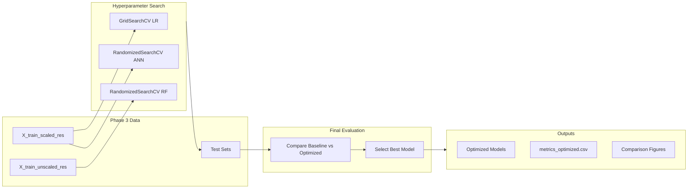

# Phase 4: Model Optimization Implementation Plan

## Current State

Baseline models trained in Phase 3 with the following test set ROC-AUC scores:

- Random Forest: 0.9642 (best baseline, but 2.4% overfitting gap)
- MLPClassifier: 0.9551 (1.9% overfitting gap)  
- Logistic Regression: 0.9485 (0.7% overfitting gap)

All models show overfitting (CV accuracy > test accuracy by 3-4%).

## Data Flow



## Implementation Steps

### 1. Setup and Data Preparation

- Copy preprocessing pipeline from `notebooks/03_model_training.ipynb` (cells 1-4)
- Produce: `X_train_scaled_res`, `X_train_unscaled_res`, `y_train_res`, `X_test_scaled`, `X_test_unscaled`, `y_test`
- Reuse evaluation functions: `evaluate_model()`, `plot_confusion_matrix()`, `print_test_results()`

### 2. Logistic Regression Optimization

Use `GridSearchCV` with parameter grid:

```python
param_grid_lr = {
    'C': [0.001, 0.01, 0.1, 1, 10, 100],
    'penalty': ['l1', 'l2'],
    'solver': ['saga', 'liblinear']
}
```

- Scoring: `roc_auc`, CV: 5-fold stratified
- Fit on `X_train_scaled_res`

### 3. Random Forest Optimization

Use `RandomizedSearchCV` (n_iter=50) with parameter distributions:

```python
param_dist_rf = {
    'n_estimators': [100, 200, 300],
    'max_depth': [10, 20, 30, None],
    'min_samples_split': [2, 5, 10],
    'min_samples_leaf': [1, 2, 4],
    'max_features': ['sqrt', 'log2', None]
}
```

- Focus on `max_depth`, `min_samples_leaf` to reduce overfitting
- Fit on `X_train_unscaled_res`

### 4. MLPClassifier Optimization

Use `RandomizedSearchCV` (n_iter=30) with parameter distributions:

```python
param_dist_ann = {
    'hidden_layer_sizes': [(50,), (100,), (100, 50), (100, 100)],
    'alpha': [0.0001, 0.001, 0.01, 0.1],
    'learning_rate_init': [0.001, 0.005, 0.01],
    'activation': ['relu', 'tanh'],
    'early_stopping': [True]
}
```

- Fit on `X_train_scaled_res`

### 5. Model Comparison and Final Selection

- Evaluate all optimized models on test set
- Create comparison table: Baseline vs Optimized (accuracy, precision, recall, F1, ROC-AUC)
- Plot side-by-side confusion matrices
- Plot overlaid ROC curves
- Analyze overfitting reduction (CV vs test gap)
- Select best model with documented justification

### 6. Save Artifacts

- `models/logistic_regression_optimized.pkl`
- `models/random_forest_optimized.pkl`
- `models/ann_model_optimized.pkl`
- `results/metrics_optimized.csv`
- `results/figures/roc_curves_optimized.png`
- `results/figures/confusion_matrices_optimized.png`

## Key Technical Considerations

| Concern | Solution |

|---------|----------|

| Data leakage | Never use test set in hyperparameter search |

| Reproducibility | Use `random_state=38` everywhere |

| Scaling | LR/ANN use scaled data, RF uses unscaled |

| Long runtime | Use `n_jobs=-1`, print progress, use RandomizedSearchCV for large grids |

| Primary metric | ROC-AUC (handles class imbalance) |